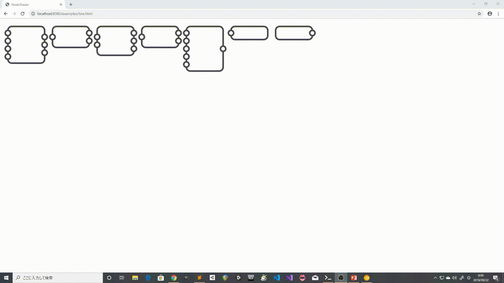

[https://twitter.com/hu_123456/status/1175426469339656192](https://twitter.com/hu_123456/status/1175426469339656192)

# このリポジトリは2つに分離しました
このリポジトリではブラウザ上で音声処理を行うソフトの開発を行っていました。
このソフトのGUI部分にはWebGLを使っていたのですが、WebGLを扱うプログラムが巨大になったため2つのリポジトリに分割することにしました。
分離後のリポジトリは以下の場所にあります。

WebGLを使った描画ライブラリ : [HydrangeaJS](https://github.com/wakewakame/HydrangeaJS)

HydrangeaJSを使った音声処理ソフト : [AudioNode](https://github.com/wakewakame/AudioNode)